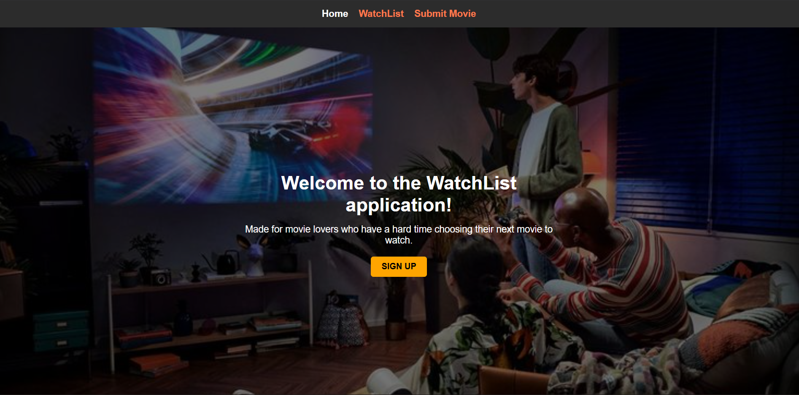
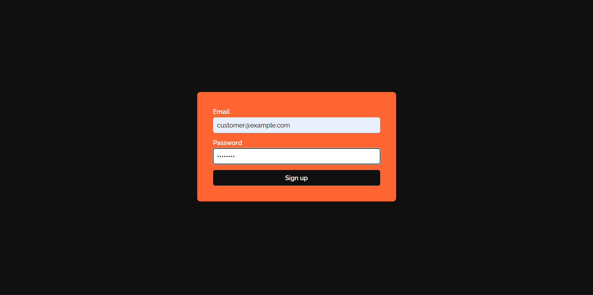
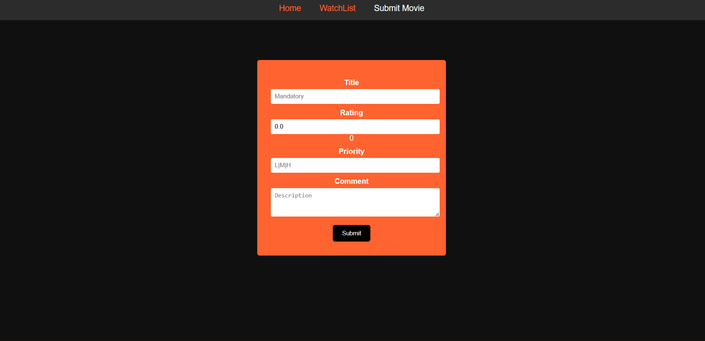
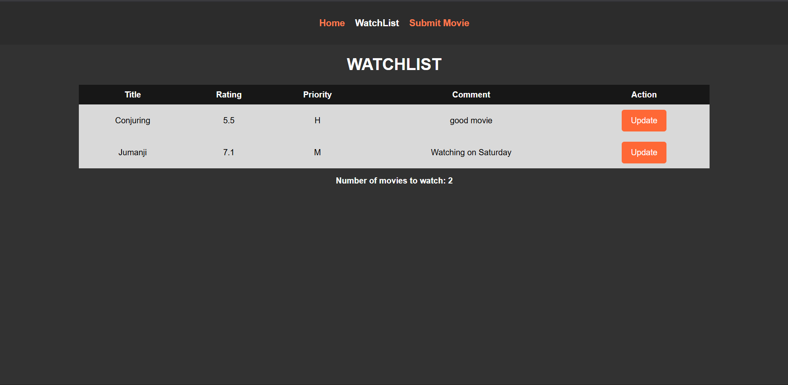

# 🎬 Watchlist App

A simple and user-friendly **Watchlist application** that allows users to search movies and manage a personal watchlist.  
Built using **Java, Spring Boot, Thymeleaf**, and the **OMDb API**.

This project demonstrates backend development skills using Spring Boot, external API integration, and server-side rendering.

---

## 🚀 Features

- 🔍 Search movies using the OMDb API  
- ➕ Add movies to a personal watchlist  
- ✏️ Edit movie details  
- ❌ Remove movies from the watchlist  
- 📋 View all saved movies in one place  
- 🖥️ Clean UI using Thymeleaf templates  

---

## 🛠 Tech Stack

- **Backend:** Java, Spring Boot  
- **Frontend:** Thymeleaf, HTML, CSS  
- **API:** OMDb API  
- **Build Tool:** Maven  

---

## 📸 Screenshots

### Home Page


### SignUp Page


### Submit Movie


### Watchlist Page


---

## ⚙️ Installation & Setup

Follow these steps to run the project locally.

### Prerequisites

- Java 17 or higher  
- Maven  
- Git  

---

### Steps

```bash
# Clone the repository
git clone https://github.com/Muskan0739/watchlist-app.git

# Navigate to the project directory
cd watchlist-app

# Build the project
mvn clean install

# Run the application
mvn spring-boot:run

#Once started, open your browser and go to:
http://localhost:8082
```
---
Once started, open your browser and go to:
```bash
http://localhost:8082
```
---
## 🔑 OMDb API Configuration

This project uses the OMDb API to fetch movie details.

Steps to configure:

   1. Get a free API key from: https://www.omdbapi.com/

   2. Add the API key to your application.properties file:
```bash
omdb.api.key=YOUR_API_KEY
```
---
## 📂 Project Structure
```bash
watchlist-app
│── src/main/java
│── src/main/resources
│   ├── templates
│   ├── static
│── pom.xml
│── README.md
```
---
## 🚧 Live Demo

🚀 Live demo coming soon

The application will be deployed shortly and the live URL will be added here.

---
## 🤝 Contributing

Contributions are welcome!

1. Fork the repository
2. Create a new branch
3. Commit your changes
4. Open a Pull Request
---
## 📄 License

This project is licensed under the MIT License.

See the `LICENSE` file for details.

---
## 👩‍💻 Author

Muskan Shukla

GitHub: https://github.com/Muskan0739

LinkedIn: https://www.linkedin.com/in/muskan-shukla-974410263/
